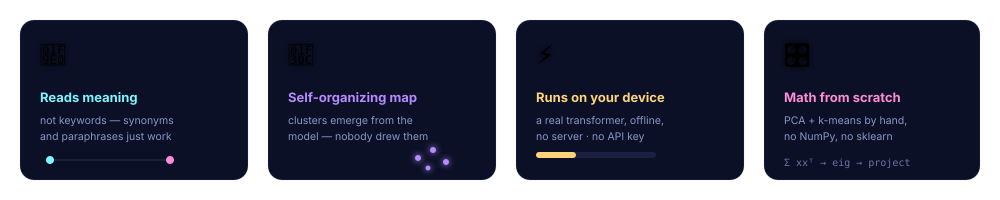
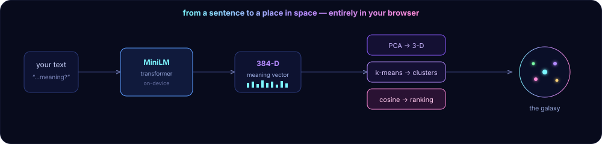

<p align="center">
  
</p>

<p align="center">
  <a href="https://mneha05.github.io/semantic-galaxy/"></a>
  
  
  
</p>

<p align="center">
  
  
  
  
</p>

<h1 align="center">🌌 Semantic Galaxy</h1>

<p align="center"><b>I wanted to <i>see</i> what a machine means when it says two ideas are "similar."<br/>So I turned a hundred ideas into a galaxy you can fly through — and search by meaning instead of by words.</b></p>

<p align="center">
  <a href="#-what-it-does">What it does</a> ·
  <a href="#-why-i-built-this">Why I built it</a> ·
  <a href="#-how-it-works">How it works</a> ·
  <a href="#-try-it">Try it</a> ·
  <a href="#-the-pieces">The code</a>
</p>

<p align="center"></p>

---

## ✨ What it does



- **Search by meaning.** Ask anything in plain English; every idea is ranked by *semantic* similarity, so synonyms and paraphrases just work.
- **A map that drew itself.** Positions come from the embeddings (via PCA); the colored clusters come from k-means. The structure emerges from the model, not from me.
- **A real transformer, in the tab.** A sentence-transformer is downloaded into your browser once, then runs **entirely on your machine** — offline, no server, no API key, nothing sent anywhere.
- **Fly through it.** Drag to orbit, scroll to zoom, hover any star to read it. Ask a question and beams shoot to the nearest concepts while the camera flies in.

> Type **“how do machines understand language?”** and the galaxy flies straight to the cluster about transformers and word embeddings — not because of shared keywords, but because the model *understands.*

---

## 💭 Why I built this

Every search bar I'd ever used matched **letters**. Type "car" and you get "car," not "automobile." But the AI models I kept reading about don't think in letters — they turn language into *vectors*, where distance means difference in **meaning**. Paraphrases land near each other even with no words in common.

I couldn't really picture that until I built it. So I gave every idea a position in space based purely on what a neural network thought it *meant*, and let myself wander around inside the result. The thing that still gets me: I never told the app which ideas belong together. The galaxy's whole shape is just… what the model learned. Nobody drew it.

---

## 🔬 How it works



1. **Embed.** Each document (and your live query) goes through `Xenova/all-MiniLM-L6-v2` via [transformers.js](https://github.com/huggingface/transformers.js), producing a 384-dimensional vector where *distance = difference in meaning*.
2. **Reduce.** 384 dimensions can't be drawn, so I wrote **PCA** (deflation + power iteration on the covariance) to project down to the 3 axes of greatest variance — the galaxy's X, Y, Z.
3. **Cluster.** **k-means** (with k-means++ seeding) groups the vectors and colors them. These groupings come from the model alone.
4. **Search.** Your query is embedded live and scored against every star by **cosine similarity**; the best matches flare up and the camera flies to them.
5. **Render.** A custom Three.js shader draws each idea as an additively-blended glowing star with real-time hover picking.

The only network call is the one-time model download, which the browser then caches.

---

## ▶️ Try it

**Live:** **[mneha05.github.io/semantic-galaxy](https://mneha05.github.io/semantic-galaxy/)** — just open it and start typing.

**Locally** (no build step):
```bash
git clone https://github.com/mneha05/semantic-galaxy.git
cd semantic-galaxy
npx serve .        # open the printed http://localhost URL
```
> Open it over `http://localhost`, not `file://` — ES modules and the model fetch need a real origin.

---

## 🧩 The pieces

| File | What it does |
|---|---|
| [`src/embed.js`](src/embed.js) | Loads the transformer, embeds text on-device, hash-embed fallback |
| [`src/ml.js`](src/ml.js) | **PCA + k-means + cosine similarity — written from scratch**, no ML libraries |
| [`src/galaxy.js`](src/galaxy.js) | Three.js scene, glow shader, query beams, raycast hover |
| [`src/main.js`](src/main.js) | Ties the pipeline to the UI |
| [`src/data.js`](src/data.js) | The concept corpus |

---

## ❓ FAQ

<details>
<summary><b>Is my data sent to a server?</b></summary><br/>
No. The model downloads once from a CDN, then all embedding and search happens in your browser. There is no backend.
</details>

<details>
<summary><b>Why does the first load take a few seconds?</b></summary><br/>
It's fetching the ~23 MB quantized transformer. After that the browser caches it and subsequent loads are instant — and it works offline.
</details>

<details>
<summary><b>Can I use my own documents?</b></summary><br/>
Yes — drop your own text into <a href="src/data.js"><code>src/data.js</code></a> and reload. It re-embeds, re-clusters, and renders <i>your</i> galaxy. Underneath the pretty costume it's a general-purpose semantic search engine.
</details>

<details>
<summary><b>Why PCA and not t-SNE/UMAP?</b></summary><br/>
PCA is deterministic, fast, and easy to implement from scratch — which was part of the point. UMAP would give tighter clusters and is on my roadmap.
</details>

---

## 🛠️ Built with
`transformers.js` (on-device inference) · `Three.js` (WebGL) · hand-rolled linear algebra · vanilla ES modules — no backend, no framework, no build step.

## 🗺️ Roadmap
- [ ] Swap PCA → UMAP and compare the shapes
- [ ] Paste-your-own-corpus box in the UI
- [ ] A flat 2-D "map view" toggle
- [ ] Multilingual embedding model

<p align="center"><br/><sub>Made by <b>Neha Mahesh</b> · <a href="LICENSE">MIT licensed</a> · ⭐ it if the galaxy made you smile</sub></p>
