<p align="center">
  
</p>

<p align="center">
  <a href="https://mneha05.github.io/semantic-galaxy/"></a>
  
  
</p>

<h1 align="center">Semantic Galaxy</h1>

<p align="center"><b>I wanted to <i>see</i> what a machine means when it says two ideas are "similar."<br/>So I turned a hundred ideas into a galaxy you can fly through — and search by meaning instead of by words.</b></p>

<p align="center"></p>

---

## Why I built this

Every search bar I'd ever used matched **letters**. Type "car" and you get "car," not "automobile." But the AI models I was reading about don't think in letters — they turn language into *vectors*, where distance means difference in **meaning**. Paraphrases land near each other even with no words in common.

I couldn't really picture that until I built it. So I gave every idea a position in space based purely on what a neural network thought it *meant*, and let myself wander around inside the result.

The thing that still gets me: I never told the app which ideas belong together. Search **"how do machines understand language?"** and it flies straight to the cluster about transformers and word embeddings — not because of shared keywords, but because the model *understands*. The galaxy's whole shape is just… what the model learned. Nobody drew it.

## What it does

- **Search by meaning.** Ask anything in plain English; every idea is ranked by *semantic* similarity, so synonyms and paraphrases just work.
- **A map that drew itself.** Positions come from the embeddings (via PCA); the colored clusters come from k-means. The structure emerges from the model, not from me.
- **A real transformer, in the tab.** A sentence-transformer is downloaded into your browser once and then runs **entirely on your machine** — offline, no server, no API key, nothing sent anywhere.
- **Fly through it.** Drag to orbit, scroll to zoom, hover any star to read it. Ask a question and watch beams shoot to the nearest concepts while the camera flies in.

> My favorite detail: the "AI" isn't in some data center. It's *right there in the page.* Which means it can't rate-limit me, can't run up a bill, and can't break because a backend went down.

## Try it

**Live:** **[mneha05.github.io/semantic-galaxy](https://mneha05.github.io/semantic-galaxy/)** — just open it and start typing.

**Locally** (no build step):
```bash
git clone https://github.com/mneha05/semantic-galaxy.git
cd semantic-galaxy
npx serve .        # open the printed http://localhost URL
```
> Open it over `http://localhost`, not `file://` — ES modules and the model fetch need a real origin.

## How it works

```
your text ─▶  MiniLM sentence-transformer  ─▶  a 384-number "meaning vector"   (on-device, in-browser)
              (Xenova/all-MiniLM-L6-v2)                 │
                                                        ├─▶ PCA  ────────▶ a 3-D position in the galaxy
                                                        ├─▶ k-means ─────▶ which glowing cluster it joins
                                                        └─▶ cosine sim ──▶ ranked answer to your query
                                                                 │
                                          Three.js additive-glow point cloud ─▶ the universe you fly through
```

1. **Embed.** Each document (and your live query) goes through the transformer via [transformers.js](https://github.com/huggingface/transformers.js), producing a 384-dimensional vector where *distance = difference in meaning*.
2. **Reduce.** 384 dimensions can't be drawn, so I wrote **PCA** (deflation + power iteration on the covariance) to project down to the 3 axes of greatest variance — the galaxy's X, Y, Z.
3. **Cluster.** **k-means** (with k-means++ seeding) groups the vectors and colors them. These groupings come from the model alone.
4. **Search.** Your query is embedded live and scored against every star by **cosine similarity**; the best matches flare up and the camera flies to them.
5. **Render.** A custom Three.js shader draws each idea as an additively-blended glowing star with real-time hover picking.

The only network call is the one-time model download, which the browser then caches.

## The pieces

| File | What it does |
|---|---|
| [`src/embed.js`](src/embed.js) | Loads the transformer, embeds text on-device, hash-embed fallback |
| [`src/ml.js`](src/ml.js) | **PCA + k-means + cosine similarity — written from scratch**, no ML libraries |
| [`src/galaxy.js`](src/galaxy.js) | Three.js scene, glow shader, query beams, raycast hover |
| [`src/main.js`](src/main.js) | Ties the pipeline to the UI |
| [`src/data.js`](src/data.js) | The concept corpus |

## Built with
`transformers.js` (on-device inference) · `Three.js` (WebGL) · hand-rolled linear algebra · vanilla ES modules — no backend, no framework, no build step.

## Make it your own
Drop your own text into [`src/data.js`](src/data.js) — notes, papers, reviews, song lyrics — and reload. It re-embeds, re-clusters, and renders *your* galaxy. Underneath the pretty costume, it's a general-purpose semantic search engine.

<p align="center"><br/><sub>Made by <b>Neha Mahesh</b> · MIT licensed</sub></p>
